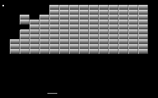

# Breakout (DOS)

This clone of Breakout is a simple learning project to teach myself some DOS programming.

## Setup

This project was developed against the Digital Mars C Compiler. Other compilers may work also.

* Extract the following compiler files into a suitable bin dir
* [Digital Mars C/C++ 8.57](http://ftp.digitalmars.com/Digital_Mars_C++/Patch/dm857c.zip)
* Extract the following lib files into the same dir as the compiler
* [Digital Mars DOS16 Libs](http://ftp.digitalmars.com/Digital_Mars_C++/Patch/dm850dos.zip)
* Update the CC macro at the top of `Makefile` to point to the compiler binary
* Run `make all` to build `breakout.exe`

The resulting binary executable should work in DosBox. It will _not_ work in Windows.
